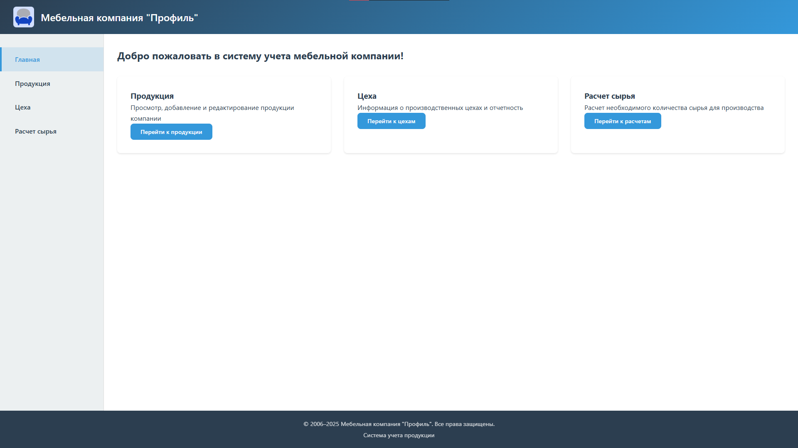
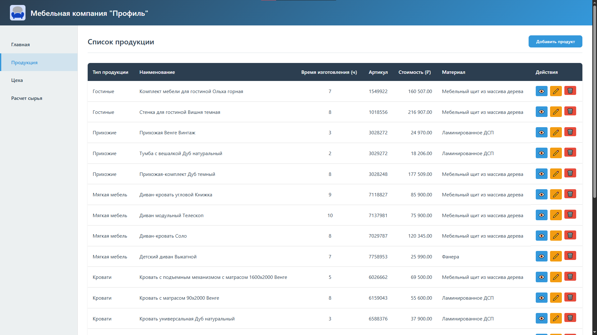
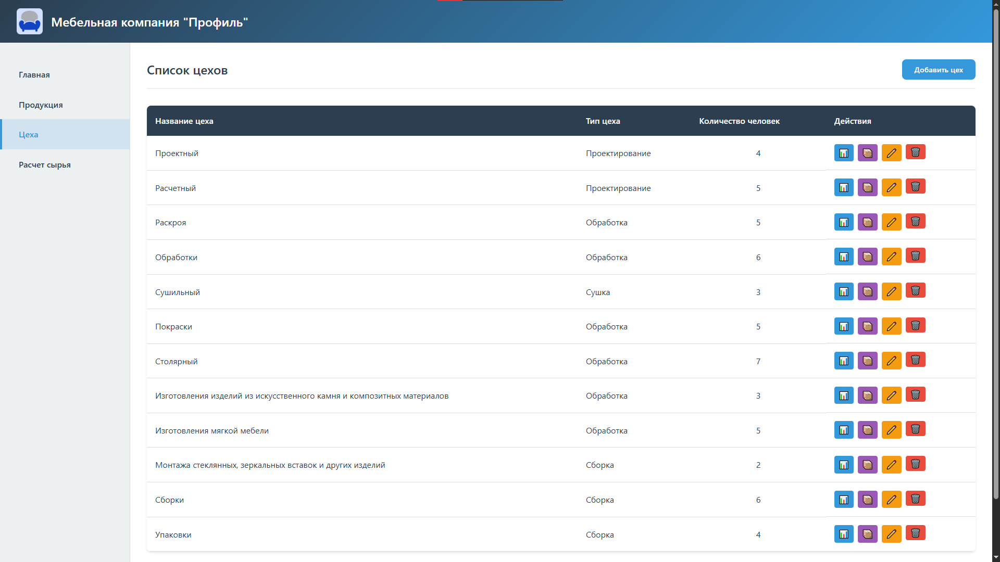
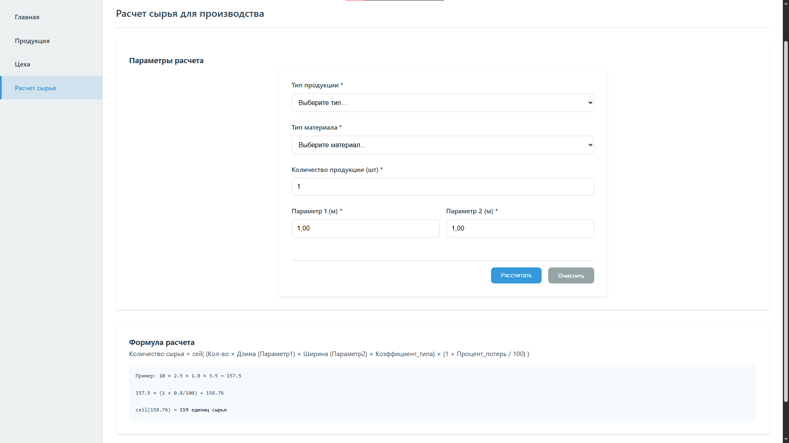
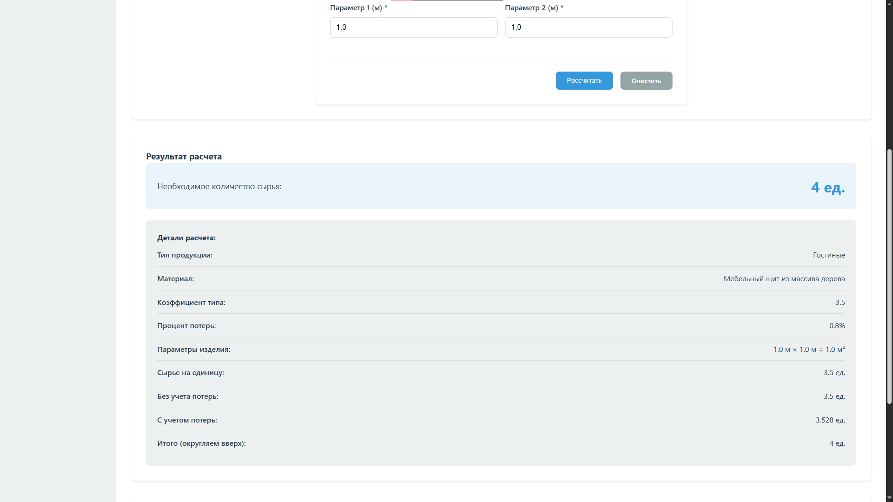

# Система учета продукции мебельной компании

Веб-приложение для учета продукции, производства и расчетов сырья для мебельной компании.

## 🚀 Технологический стек

Компонент Технологии

**Backend** Python, FastAPI, SQLAlchemy

**Frontend** HTML, CSS, Jinja2 шаблоны

**База данных** SQLite

**Обработка данных** Pandas, Openpyxl

## ✨ Основные функции системы

### 📦 Управление продукцией

-   Просмотр списка продукции с детальной информацией
-   Добавление новых продуктов
-   Редактирование существующих продуктов
-   Удаление продуктов
-   Расчет времени изготовления (суммирование времени по цехам)

### 🏭 Управление цехами

-   Просмотр списка производственных цехов
-   Добавление новых цехов
-   Редактирование информации о цехах
-   Просмотр продукции, производимой в каждом цехе
-   Отчеты о производственной деятельности

### 📊 Расчет сырья

-   Расчет необходимого количества сырья для производства
-   Учет параметров продукции (длина, ширина)
-   Учет коэффициентов типа продукции
-   Учет процента потерь материала
-   Детализированный отчет по расчету

### 🔧 API интерфейс

-   Полный REST API для интеграции с другими системами
-   CRUD операции для всех сущностей
-   Расчетные эндпоинты для бизнес-логики
-   Автоматическая документация OpenAPI

## 🛠️ Работа с данными

### Форматы данных

-   **Импорт:** Excel файлы (`.xlsx`)
-   **База данных:** SQLite (`.db`)
-   **Экспорт:** SQL скрипты, JSON через API

### Структура данных

-   Типы продукции (Гостиные, Прихожие, Мягкая мебель и т.д.)
-   Типы материалов (Мебельный щит, ДСП, Фанера, МДФ)
-   Продукция с артикулами, ценами и спецификациями
-   Цеха с типами и количеством сотрудников
-   Производственные связи между продукцией и цехами

## ⚙️ Пошаговая инструкция по запуску

### Шаг 1: Подготовка окружения

Клонируйте репозиторий (если проект скачан как архив - распакуйте его).

Перейдите в директорию проекта:

```bash
cd furniture_company_system
```

### Шаг 2: Создание виртуального окружения

Для Windows:

```bash
python -m venv venvvenvScriptsactivate
```

Для Linux/Mac:

```bash
python3 -m venv venvsource venv/bin/activate
```

### Шаг 3: Установка зависимостей

Установите все необходимые пакеты:

```bash
pip install -r requirements.txt
```

### Шаг 4: Импорт исходных данных

Запустите скрипт для импорта данных из Excel-файлов:

```bash
python -m app.scripts.import_data
```

**Результат:**

-   Создана база данных `furniture.db` в папке `app/database/`
-   Данные из Excel файлов импортированы в соответствующие таблицы

### Шаг 5: Валидация импортированных данных

Проверьте корректность импорта данных:

```bash
python -m app.scripts.validate_import
```

**Ожидаемый результат:** Все проверки пройдены успешно.

### Шаг 6: (Опционально) Получение SQL-скрипта БД

Если нужно получить SQL-скрипт созданной базы данных:

```bash
python -m app.database.get_sql
```

**Результат:** В файле `app/database/db_sql.sql` будет полный SQL-скрипт для воссоздания структуры БД.

### Шаг 7: Запуск приложения

Запустите основное приложение:

```bash
python -m app.main
```

**Ожидаемый вывод:**

```text
INFO:     Will watch for changes in these directories: [...]INFO:     Uvicorn running on http://127.0.0.1:8000 (Press CTRL+C to quit)
```

### Шаг 8: Открытие приложения в браузере

Скопируйте URL из консоли: `http://127.0.0.1:8000`

Или откройте браузер и перейдите по адресу: `http://localhost:8000`

<!-- ## 🔗 Доступные разделы приложения

### Веб-интерфейс (фронтенд)


-   **Главная страница:** `http://localhost:8000/`

-   **Продукция:** `http://localhost:8000/products` - просмотр, добавление, редактирование

-   **Цеха:** `http://localhost:8000/workshops` - информация о производственных цехах


-   **Расчет сырья:** `http://localhost:8000/calculations` - расчет необходимого количества сырья

### API документация (Swagger) -->

## 🔗 Доступные разделы приложения

### Веб-интерфейс (фронтенд)

- **Главная страница:** `http://localhost:8000/`
  

- **Продукция:** `http://localhost:8000/products` - просмотр, добавление, редактирование
  

- **Цеха:** `http://localhost:8000/workshops` - информация о производственных цехах
  

- **Расчет сырья:** `http://localhost:8000/calculations` - расчет необходимого количества сырья
  
  

### API документация (Swagger)

-   **Swagger UI:** `http://localhost:8000/api/docs`

## 🔍 Отладка и мониторинг

### Проверка работоспособности

-   **Health check:** `http://localhost:8000/health`
-   **API health:** `http://localhost:8000/api/health`

### Логирование

-   Все операции импорта логируются в `import.log`
-   Ошибки приложения выводятся в консоль
-   SQL запросы логируются при запуске в режиме разработки

## ❗ Возможные проблемы и решения

Проблема Решение

**"Модуль не найден"**

Убедитесь, что виртуальное окружение активировано: `venvScriptsactivate` (Windows) или `source venv/bin/activate` (Linux/Mac).

**"Порт 8000 занят"**

Остановите другие приложения на порту 8000 или измените порт в `app/main.py` (например, на `port=8001`).

**"Ошибка импорта данных"**

Проверьте наличие файлов в папке `data/isxod/`. Убедитесь в правильности формата Excel файлов. Запустите скрипт валидации для диагностики.

**"Страница не загружается"**

Проверьте, что сервер запущен (`python -m app.main`), нет ошибок в консоли и проверьте подключение к `http://localhost:8000/health`.

## 📄 Лицензия и контакты

© 2006–2025 Мебельная компания "Профиль". Все права защищены.

Для учебных целей - проект разработан в рамках учебной практики.